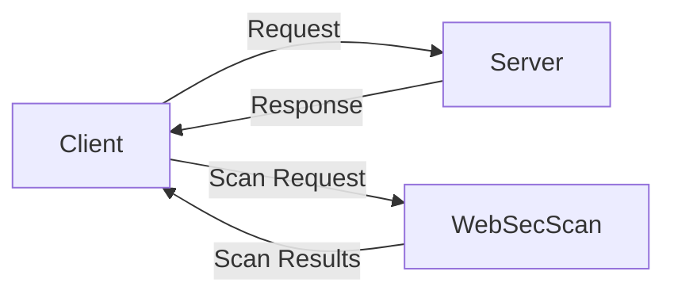

# WebSecScan

A Python-based web application security scanner that identifies common vulnerabilities such as SQL injection and cross-site scripting.

## Problem Statement

Web applications are constantly under attack by malicious actors seeking to exploit vulnerabilities for personal gain. Identifying and remediating these vulnerabilities is crucial to preventing security breaches.

## Why It Matters

WebSecScan helps developers and organizations identify vulnerabilities in their web applications, allowing them to take proactive measures to secure their systems and protect their users.

## Architecture Diagram


## Project Structure
```
WebSecScan/
    main.py
    src/
        __init__.py
        scanner.py
        parser.py
        utils.py
    requirements.txt
    README.md
    CONTRIBUTING.md
    LICENSE
```

## Installation Steps

1. Clone the repository: `git clone https://github.com/your-username/WebSecScan.git`
2. Install dependencies: `pip install -r requirements.txt`
3. Run the scanner: `python main.py --help`

## Quick Start

1. Run the scanner: `python main.py --url https://example.com`
2. Review scan results: `cat scan_results.txt`

## Configuration

* `--url`: specify the URL of the web application to scan
* `--output-file`: specify the file to write scan results to

## Design Decisions

* The scanner uses a modular design to allow for easy extension and modification of scanning logic.
* Scan results are written to a file to allow for easy review and remediation.

## Roadmap

* Implement support for additional vulnerability types
* Improve scan performance and efficiency
* Develop a web-based interface for the scanner

## Contribution

* PR workflow: fork the repository, make changes, and submit a pull request
* Commit standards: follow the GitHub commit guidelines
* Code style rules: follow PEP 8

## License

* MIT License
